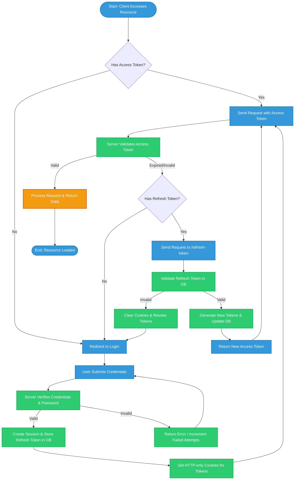
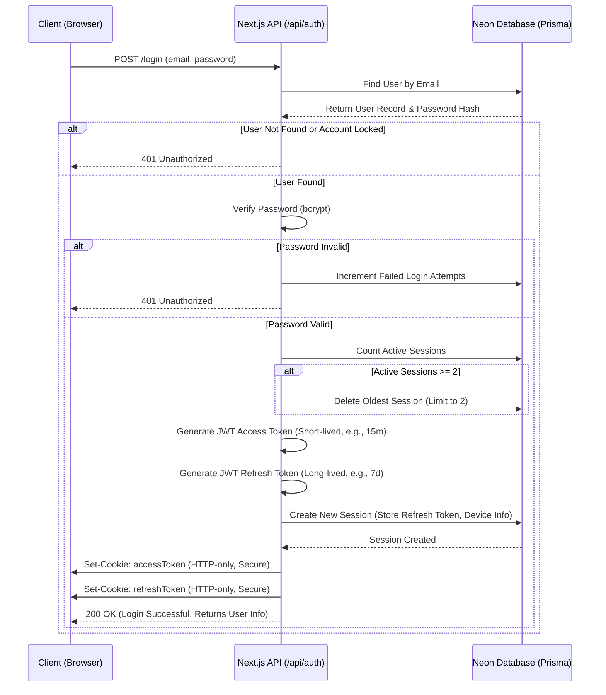
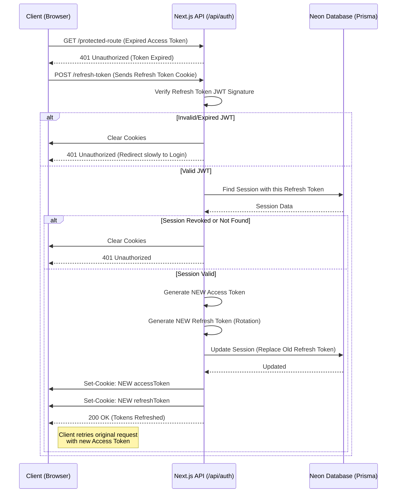

# Authentication Flow Diagram

This document contains visual diagrams illustrating how the JWT-based authentication system works, including the roles of the client, server, database, and tokens.

## 1. Authentication Activity Flow (Flowchart)

This flowchart represents the high-level activity flow when a user attempts to access a protected resource and logs in.

## 2. Sequence Diagram: Login and Session Creation

This sequence diagram details the exact interactions between the Client window, Next.js API (Server), and Neon Database during a login event.

## 3. Sequence Diagram: Token Refresh Flow

When the Access Token expires, this flow silently requests new tokens using the Refresh Token without requiring the user to log in again.

## How the Elements Work Together:

1. **JWT (JSON Web Tokens)**:
   - **Access Token**: Contains user claims (e.g., `userId`, `role`). Used to authorize requests to protected API endpoints. It is short-lived to minimize damage if hijacked.
   - **Refresh Token**: A cryptographically signed token used to get a new Access Token. It is long-lived but tightly coupled with the database.
   
2. **Database (Neon PostgreSQL & Prisma)**:
   - Does NOT store the Access Token.
   - Stores the hashed `Refresh Token` in a `Session` model.
   - Allows tracking devices and enforcing session limits (e.g., maximum 2 devices simultaneously). If a user logs in on a 3rd device, the oldest session in the DB is deleted, effectively logging out the 1st device on its next refresh attempt.
   
3. **HTTP-only Cookies**:
   - Both tokens are sent to the client via `Set-Cookie` HTTP headers with `HttpOnly`, `Secure`, and `SameSite=Strict` attributes.
   - This prevents Cross-Site Scripting (XSS) from stealing the tokens, as JavaScript cannot read HTTP-only cookies.
